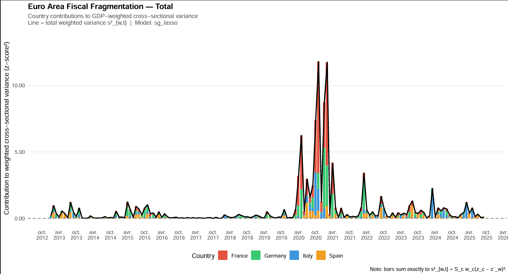
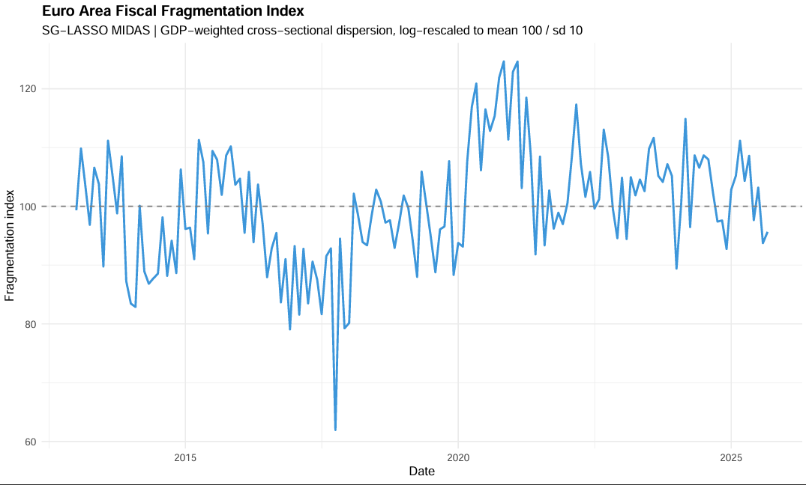
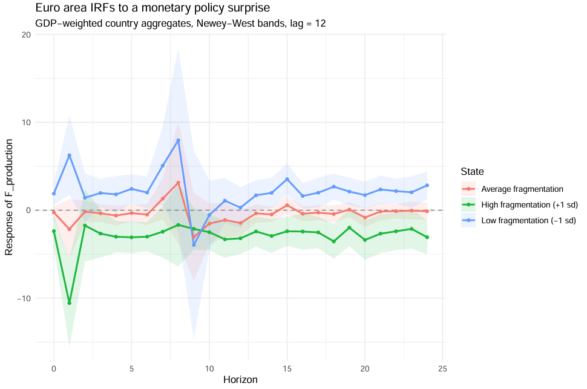

<p align="center">
  <strong>ENSAE Paris - Project in Economics, Sociology and Data Science</strong>
</p>

---
# Fiscal Fragmentation and Monetary Policy Transmission in the Euro Area


> A multi-model nowcasting pipeline for quarterly government revenues and expenditures in Germany, France, Italy and Spain, with applications to the construction of a country-level Fiscal Surprise Index, a euro area Fiscal Fragmentation Index, and applications to monetary policy using high-frequency identification of monetary policy shocks.

**Author:** Timothée Dangleterre, Nathan Granier and Giovanni Manche 
**Institution:** [ENSAE Paris](https://www.ensae.fr) | Institut Polytechnique de Paris  
**Language:** R (≥ 4.1)  
**Last updated:** May 2026


This repository implements a pseudo-real-time fiscal nowcasting pipeline for the four largest euro area economies, constructz a  novel **Fiscal Fragmentation Index** and uses it to study its impact on the transmission of ECB monetary policy shocks.

We define fiscal fragmentation as the divergence in fiscal conditions across member states and measure it in real time using a novel index based on cross-
country dispersion of fiscal nowcast revisions. 

--- 
## Table of Contents

1. [Quick Start](#1-quick-start)  
2. [Project Structure](#2-project-structure)  
3. [Configuration and Setup](#3-configuration-and-setup)  
4. [Pipeline Overview](#4-pipeline-overview)  
5. [Pre-Compiled Results](#5-pre-compiled-results)  
6. [Selected Results](#6-selected-results)  
   - 6.1 [Nowcasting Performance](#61-nowcasting-performance)  
   - 6.2 [Nowcast Surprise Index](#62-nowcast-surprise-index)  
   - 6.3 [Fiscal Fragmentation Index](#63-fiscal-fragmentation-index)  
   - 6.4 [Monetary Policy Transmission](#64-monetary-policy-transmission)  
7. [Outputs Reference](#7-outputs-reference)  
8. [Dependencies](#8-dependencies)  
9. [Licence](#9-licence)  

---
## 0. Installation
```
git clone https://github.com/GiovanniManche/ESSD.git
cd ESSD
Rscript -e "install.packages('pacman', repos='https://cloud.r-project.org')"
Rscript main.R
```
## 1. Quick Start

### Running with pre-compiled results (recommended)

All model estimation results have been pre-computed and saved as `.rds` files in `data/processed/`. To reproduce every figure, table and index **without re-estimating the models**, open `configuration.R` and set:

```r
REFRESH_CLEANING <- FALSE
REFRESH_MODELS   <- FALSE
```

Then run the full pipeline:

```r
source("main.R")
```

This executes scripts `03` through `07` (visualisation, forecast metrics, surprise index construction, panel local projections and the euro area monetary-policy analysis) using the stored `.rds` results. Execution takes only a few minutes.

### Full re-estimation

> **Warning.** Running the complete pseudo-real-time estimation loop across 4 countries × 2 fiscal blocks × 4 models is computationally intensive (approximately **5 hours** on a standard laptop). This is due to the rolling re-estimation required at every publication date in the pseudo-real-time framework. We strongly recommend using the pre-compiled `.rds` files unless parameter changes are specifically needed.

To re-run everything from scratch:

```r
REFRESH_CLEANING <- TRUE
REFRESH_MODELS   <- TRUE
source("main.R")
```

---

## 2. Project Structure

```
ESSD-Vdef/
│
├── main.R                        # Entry point - orchestrates the full pipeline
├── configuration.R               # User-facing parameters (models, countries, windows)
├── _setup.R                      # Environment bootstrap (packages, directory tree, function loading)
│
├── data/
│   ├── raw/                      # Country-level Excel files (revenues & expenditures)
│   │   ├── data_france.xlsx
│   │   ├── data_germany.xlsx
│   │   ├── data_italy.xlsx
│   │   └── data_spain.xlsx
│   ├── processed/                # Pre-compiled .rds results (see §5)
│   ├── EA_MD_DB/                 # Euro Area Macroeconomic Database (EA-MD) by country
│   ├── EA-EMDP.xlsx              # ECB monetary policy announcement data (OIS responses), for monetary policy surprises
│   ├── gdp_series.csv            # Quarterly GDP for GDP-weighting
│   └── publication_delay.xlsx    # Country-specific publication lags (month + day offsets)
│
├── R/                            # Function library (auto-sourced by _setup.R)
│   ├── nowcasting/               # Core nowcasting models and utilities
│   │   ├── factor_midas.R        # Factor-MIDAS estimation
│   │   ├── sg_lasso.R            # Sparse-Group LASSO MIDAS estimation
│   │   ├── baselines.R           # AR(1) and Random Walk benchmarks
│   │   ├── pseudo_real_time.R    # Pseudo-real-time engine
│   │   ├── vintage_transformation.R  # Ragged-edge vintage builder
│   │   ├── utils_midas.R         # MIDAS regression helpers
│   │   ├── metrics.R             # RMSE, MAE, R² functions
│   │   └── baing.R               # Bai & Ng (2002) factor selection
│   ├── preprocessing/            # Data cleaning and stationarisation
│   │   ├── decumulate.R          # Year-to-date → quarterly flow conversion
│   │   ├── seasonal_adjustment.R # X-13ARIMA-SEATS seasonal adjustment
│   │   ├── stationarity_analysis.R   # ADF testing
│   │   ├── stationarization_scheme.R # Differencing / log-differencing
│   │   ├── dickey_fuller_table.R # ADF result formatting
│   │   └── utils.R               # Date helpers, publication delay logic
│   ├── plots/                    # Visualisation functions
│   │   ├── plot_nowcast.R        # Nowcast vs. realised series
│   │   ├── plot_comparison.R     # Multi-model comparison grids
│   │   └── plot_series.R         # Raw series inspection
│   └── MP/                       # Monetary policy module
│       ├── mps.R                 # Monetary policy surprise construction (Gürkaynak et al., 2005)
│       ├── panel_LP.R            # Panel local projections with fixed effects
│       ├── ea_md_gestion.R       # EA-MD factor extraction and aggregation
│       └── euro_area_utils.R     # EA-level regressions, IRFs, marginal effects
│
├── scripts/                      # Sequential pipeline scripts
│   ├── 01_data_handling.R        # Data import, decumulation, SA, ADF, stationarisation
│   ├── 02_nowcasting_estimation.R# Pseudo-real-time nowcasting loop (all models × countries)
│   ├── 03_visualisation.R        # Nowcast vs. realised 2×2 grids
│   ├── 04_forecast_metrics.R     # RMSE, MAE, R² evaluation with publication-aware mapping
│   ├── 05_surprise_index.R       # Surprise computation, Climate Index, Fragmentation Index
│   ├── 06_panel_local_projections.R  # Country-level panel LPs (MPS × fiscal surprise)
│   └── 07_euro_area_analysis.R   # EA-level static regressions, LPs, conditional IRFs
│
├── outputs/
│   ├── figures/
│   │   ├── nowcast/              # Nowcast vs. realised grids (per block)
│   │   ├── surprises/            # Raw intra-monthly surprise bar charts
│   │   ├── index/                # Climate Index, Fragmentation Index, country contributions
│   │   └── monetary_policy/      # MPS series, marginal effects, gamma_h, conditional IRFs
│   ├── tables/
│   │   ├── nowcast_performances/ # Forecast metrics (RMSE, MAE, R²) in CSV
│   │   ├── index/                # Surprise indices and country contributions in CSV
│   │   └── monetary_policy/      # Regression tables, LP coefficients, IRFs in CSV & XLSX
│   └── logs/                     # Per-model nowcast logs and execution summaries
│
└── README.md
```

---

## 3. Configuration and Setup

The project separates **environment bootstrap** (`_setup.R`) from **user-facing parameters** (`configuration.R`).

### `_setup.R` - Environment Bootstrap

This file is sourced first by `main.R` and by any script run independently. It performs three tasks:

1. **Package management.** Loads (and installs if necessary) all required R packages via `pacman::p_load()`.
2. **Directory creation.** Ensures all required output directories exist (`outputs/figures/…`, `outputs/tables/…`, `outputs/logs/`, etc.).
3. **Function loading.** Recursively sources every `.R` file under `R/`, making all custom functions available in the global environment.

### `configuration.R` - Pipeline Parameters

This file centralises all parameters that a user might wish to modify before a run:

| Parameter | Default | Description |
|---|---|---|
| `REFRESH_CLEANING` | `TRUE` | Re-run script `01` (data preprocessing) |
| `REFRESH_MODELS` | `TRUE` | Re-run script `02` (nowcasting estimation) |
| `list_countries` | `Germany, France, Italy, Spain` | Countries to nowcast |
| `list_blocks` | `Revenues, Expenditures` | Fiscal aggregates to nowcast |
| `list_models` | `factor_midas, sg_lasso, ar1, rw` | Models to estimate |
| `start_nowcast` | `2013-01-01` | Start of the pseudo-real-time window |
| `window_method` | `expanding` | Expanding or rolling window |
| `kmax_factor` | `4` | Maximum number of latent factors (Factor-MIDAS) |
| `lags_factors_factor` | `2` | Number of factor lags in MIDAS regression |
| `x_lags_sgl` | `2` | Monthly predictor lags (sg-LASSO) |
| `y_lags_sgl` | `1` | Quarterly target AR lags (sg-LASSO) |
| `legendre_degree_sgl` | `0` | Legendre polynomial degree for MIDAS weights |
| `gamma_sgl` | `0.5` | LASSO vs. Group-LASSO mixing parameter |

---

## 4. Pipeline Overview

The pipeline is orchestrated by `main.R` and proceeds through seven sequential stages:

```
main.R
  │
  ├─ _setup.R                          # Environment + function loading
  ├─ configuration.R                   # Parameters
  │
  ├─ 01_data_handling.R                # Import → Decumulation → Seasonal Adjustment → ADF → Stationarisation
  │       └─ Saves: data/processed/data_full_treatments.rds
  │
  ├─ 02_nowcasting_estimation.R        # Pseudo-real-time loop (4 models × 4 countries × 2 blocks)
  │       └─ Saves: data/processed/nowcast_<model>_<country>_<block>.rds
  │
  ├─ 03_visualisation.R                # 2×2 nowcast vs. realised grids
  │       └─ Saves: outputs/figures/nowcast/
  │
  ├─ 04_forecast_metrics.R             # RMSE, MAE, R² with publication-aware target mapping
  │       └─ Saves: outputs/tables/nowcast_performances/
  │
  ├─ 05_surprise_index.R               # Nowcast surprises → monthly aggregation → z-scoring
  │       │                              → GDP-weighted Climate Index & Fragmentation Index
  │       │                              → Country contributions (additive decomposition)
  │       └─ Saves: outputs/tables/index/ + outputs/figures/index/ + outputs/figures/surprises/
  │
  ├─ 06_panel_local_projections.R      # Country-level panel LPs (MPS × country-level fiscal index)
  │
  └─ 07_euro_area_analysis.R           # Euro area static regressions, LPs, conditional IRFs
          └─ Saves: outputs/tables/monetary_policy/ + outputs/figures/monetary_policy/
```

The pipeline is designed to be **idempotent**: if the `.rds` files already exist and `REFRESH_*` flags are set to `FALSE`, the estimation-heavy steps are skipped entirely, and downstream scripts load the pre-compiled results directly.

---

## 5. Pre-Compiled Results

Re-estimating the full nowcasting pipeline across 4 countries, 2 fiscal blocks and 4 models requires approximately **5 hours of computation** due to the pseudo-real-time loop, which re-estimates every model at each publication date over more than a decade of data.

To avoid this, all estimation results are stored as serialised R objects (`.rds`) in `data/processed/`:

| File | Content |
|---|---|
| `data_full_treatments.rds` | Fully preprocessed data (raw, SA, ADF diagnostics, stationary series) |
| `nowcast_all_results.rds` | Consolidated dataframe of all nowcast results |
| `nowcast_<model>_<country>_<block>.rds` | Individual nowcast results (32 files: 4 models × 4 countries × 2 blocks) |

When `REFRESH_MODELS = FALSE` (the recommended setting), `main.R` loads these files and proceeds directly to visualisation, evaluation and index construction.

---

## 6. Selected Results

### 6.1 Nowcasting Performance

Each nowcast is evaluated against the next unpublished quarterly target, using publication delay metadata to ensure correct temporal alignment. Two evaluation samples are considered:

- **All vintages:** every pseudo-real-time nowcast (averaging performance across the full information flow).
- **Last before release:** only the most informed nowcast for each target quarter.

#### RMSE - All Vintages

| Country | Block | Factor-MIDAS | sg-LASSO | AR(1) | Random Walk |
|---|---|---:|---:|---:|---:|
| **Germany** | Revenues | 9 381 | 9 546 | **7 712** | 11 149 |
| | Expenditures | 12 767 | **8 760** | 8 693 | 12 583 |
| **France** | Revenues | 9 515 | 9 777 | 10 075 | 11 945 |
| | Expenditures | 5 062 | **4 878** | 5 465 | 7 173 |
| **Italy** | Revenues | 7 262 | 6 817 | **4 805** | 5 930 |
| | Expenditures | 8 062 | 8 061 | **7 627** | 10 713 |
| **Spain** | Revenues | **4 491** | 5 392 | 4 422 | 6 636 |
| | Expenditures | 11 717 | 9 377 | **5 854** | 8 248 |

#### MAE - All Vintages

| Country | Block | Factor-MIDAS | sg-LASSO | AR(1) | Random Walk |
|---|---|---:|---:|---:|---:|
| **Germany** | Revenues | 6 080 | 6 126 | **4 843** | 6 651 |
| | Expenditures | 8 477 | **5 687** | 5 886 | 8 230 |
| **France** | Revenues | 4 950 | **4 682** | 4 728 | 5 963 |
| | Expenditures | 3 222 | **2 970** | 3 183 | 3 817 |
| **Italy** | Revenues | 4 164 | 3 930 | **3 252** | 4 263 |
| | Expenditures | **4 446** | 4 497 | 4 023 | 6 067 |
| **Spain** | Revenues | **2 362** | 2 739 | 2 637 | 3 470 |
| | Expenditures | 5 500 | 5 153 | **3 555** | 4 866 |

> **Summary.** The sg-LASSO MIDAS model dominates the Factor-MIDAS in most expenditure blocks, while the AR(1) baseline performs surprisingly well for revenues - a pattern consistent with the higher persistence of fiscal series. Both structural models consistently outperform the Random Walk benchmark. 

---

### 6.2 Nowcast Surprise Index

The surprise index is constructed from the two structural nowcasting models (Factor-MIDAS and sg-LASSO) as follows:

1. **Intra-monthly surprises.** At each publication date *t*, the surprise is defined as the revision in the nowcast: *S_t = Ŷ_t − Ŷ_{t−1}*.
2. **Monthly aggregation.** All intra-monthly surprises are summed to obtain a country-level monthly surprise.
3. **Total block.** The Total surprise is computed as: *Total = Revenues − Expenditures* (a positive total surprise indicates better-than-expected fiscal balance).
4. **Z-scoring.** Each country's monthly surprise series is standardised over the full sample.
5. **Fiscal Surprise Climate-like Index.** The GDP-weighted average of country z-scores is rescaled to mean 100, standard deviation 10. "Climate-like" because transformation follows the "Climat des affaires" index transformation from INSEE. 

| Climate Index | Interpretation |
|---|---|
| **> 100** | Fiscal news across the euro area better than the historical average |
| **< 100** | Fiscal news worse than the historical average |

Country contributions to the Climate Index are exactly additive:

$$\text{Climate Index}_t - 100 = \sum_c \text{contrib}_{c,t}$$

This allows identifying which countries drive aggregate fiscal surprises at any point in time.

---

### 6.3 Fiscal Fragmentation Index

The Fragmentation Index captures the **cross-country dispersion** of fiscal surprises:

1. **Weighted cross-sectional standard deviation.** For each month, the GDP-weighted cross-sectional standard deviation of country z-scores is computed.
2. **Log-rescaling.** The logarithm of the weighted standard deviation is rescaled to mean 100, standard deviation 10.

| Fragmentation Index | Interpretation |
|---|---|
| **> 100** | Cross-country fiscal surprise dispersion higher than historical average (countries *diverging*) |
| **< 100** | Dispersion lower than historical average (countries *converging*) |

Country contributions to the underlying weighted variance are exactly additive:

$$\sigma^2_{w,t} = \sum_c w_{c,t} \cdot (z_{c,t} - \bar{z}_{w,t})^2$$

where contributions are non-negative by construction (squared deviations weighted by GDP shares). Due to the log non-linearity, we cannot compute contributions to the log-scaled index.





### Fiscal Fragmentation Index



---

### 6.4 Monetary Policy Transmission

The monetary policy analysis investigates whether **euro area fiscal fragmentation amplifies or dampens the transmission of ECB monetary policy surprises** to industrial production.

#### Monetary Policy Surprises (MPS)

Monetary policy surprises are constructed following Gürkaynak, Sack and Swanson (2005), adapted to the euro area. The surprise is the sum of two standardised factors:
- **Target factor:** response of the 1-month OIS to ECB announcements.
- **Path factor:** residual from regressing the 1-year OIS response on the 1-month OIS response.

#### Static Regression

The baseline specification is:

$$\Delta F^{\text{prod}}_t = \beta \cdot \text{MPS}_t + \gamma \cdot (\text{MPS}_t \times \text{Frag}_t) + \delta \cdot \text{Frag}_t + X_t'\theta + \varepsilon_t$$

where *X_t* includes EA-MD factors for Labor, Financials, Turnover, Prices and Confidence, and standard errors are Newey-West.

Two specifications are estimated:
1. **GDP-weighted country aggregates** (NW lag = 24)
2. **Direct euro area EA-MD factors** (NW lag = 14)

| Coefficient | GDP-Weighted | Direct EA |
|---|---|---|
| **MPS × Frag** | **−2.17\*\*\*** (0.59) | **−1,02\*** (0.54) |

> **Key finding.** The interaction coefficient *γ* is **negative and statistically significant** (p < 0.001 in the GDP-weighted specification). This implies that when fiscal fragmentation is high, a contractionary monetary policy surprise produces a **larger decline** in industrial production - i.e., fragmentation **amplifies** monetary policy transmission. A one-standard deviation increase in fiscal fragmentation makes the marginal effect of a restrictive monetary policy surprise more negative by about 2.17 units of the production factor. 

#### Local Projections and Conditional IRFs

Local projections extend the static analysis to a dynamic horizon *h* = 0, …, 24 months:

$$F^{\text{prod}}_{t+h} - F^{\text{prod}}_{t-1} = \beta_h \cdot \text{MPS}_t + \gamma_h \cdot (\text{MPS}_t \times \text{Frag}_t) + X_t'\theta_h + \varepsilon_{t+h}$$

The interaction coefficient path **γ_h** measures how the amplification effect evolves over time. Conditional impulse response functions are constructed for three states:
- **Low fragmentation** (−1 s.d.)
- **Average fragmentation** (mean)
- **High fragmentation** (+1 s.d.)

> The conditional IRFs show that under **high fragmentation**, the contractionary effect of a monetary policy tightening surprise is **substantially larger and more persistent** than under low fragmentation, with the divergence peaking around 6–12 months after the shock.

---

## 7. Outputs Reference

### Figures

| Directory | Contents |
|---|---|
| `outputs/figures/nowcast/` | 2×2 grids: nowcast vs. realised series (per fiscal block) |
| `outputs/figures/surprises/` | Raw intra-monthly surprise bar charts (per model × block) |
| `outputs/figures/index/budget_surprises_level_index/` | Euro Area Climate Index + country contribution decompositions |
| `outputs/figures/index/fragmentation_index/` | Euro Area Fragmentation Index time series |
| `outputs/figures/index/country_level/` | Country-level surprise indices (per model) |
| `outputs/figures/monetary_policy/` | MPS series, marginal effects, γ_h coefficients, conditional IRFs |

### Tables

| File | Contents |
|---|---|
| `outputs/tables/nowcast_performances/forecast_metrics_*.csv` | RMSE, MAE, R² by model × country × block × sample |
| `outputs/tables/index/euro_area_indices.csv` | Monthly Climate Index and Fragmentation Index |
| `outputs/tables/index/country_monthly_surprise_index.csv` | Country-level monthly surprise z-scores |
| `outputs/tables/index/country_contributions_climate_index.csv` | Exact additive country contributions to Climate Index |
| `outputs/tables/index/country_contributions_fragmentation_index.csv` | Country contributions to Fragmentation variance |
| `outputs/tables/monetary_policy/monetary_policy_results.xlsx` | Full Excel workbook with all MP regression outputs |
| `outputs/tables/monetary_policy/static_regression_results.csv` | Static regression coefficients (Newey-West) |
| `outputs/tables/monetary_policy/lp_gamma_interaction_coefficients.csv` | γ_h interaction paths from local projections |
| `outputs/tables/monetary_policy/lp_conditional_irfs.csv` | Conditional IRFs (low/average/high fragmentation) |

---

## 8. Dependencies

All dependencies are managed automatically by `pacman` via `_setup.R`. The main packages used are:

| Package | Purpose |
|---|---|
| `midasr` | MIDAS regression estimation |
| `midasml` | Sparse-Group LASSO MIDAS with Legendre polynomials |
| `seasonal` | X-13ARIMA-SEATS seasonal adjustment |
| `urca` | Augmented Dickey-Fuller tests |
| `fixest` | Panel fixed-effects estimation (country × time FE in LPs) |
| `sandwich` | Newey-West HAC variance-covariance estimators |
| `lmtest` | Coefficient tests with robust standard errors |
| `ggplot2` + `patchwork` | All visualisations |
| `dplyr`, `tidyr`, `purrr`, `lubridate` | Data manipulation |
| `readxl`, `writexl` | Excel I/O |
| `zoo` | Time series utilities |
| `here` | Portable path management |
> **Note on `midasml`.** This package requires a working C++ compiler.
> On Windows, install [Rtools](https://cran.r-project.org/bin/windows/Rtools/)
> before running `_setup.R`. On macOS, Xcode Command Line Tools are required.
---

## 9. Licence

This project was developed as part of the academic curriculum at ENSAE Paris. Please refer to the project report for full references, methodology and theoretical background.
